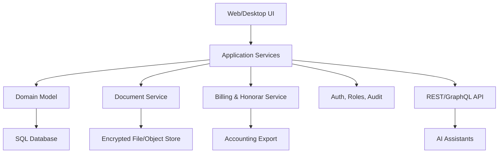

# Architektur

## Zielbild

Projektverwaltung_WTF soll langfristig als kommerzielle Buero-Plattform funktionieren. Die erste Version ist bewusst lokal und einfach startbar, aber entlang einer Architektur geschnitten, die spaeter Backend, Desktop-App, Mehrplatzbetrieb und API-Anbindungen aufnehmen kann.

## Schichten

## Frontend

- Aktuell: Vanilla HTML/CSS/JavaScript ohne externe Abhaengigkeiten.
- Ziel: React/Vue/Svelte oder Tauri/Electron-Frontend, sobald die Produktlogik stabiler ist.
- UI-Prinzip: Arbeitsoberflaeche statt Landingpage, dichte Informationen, kurze Wege, klare Projektakte.

## Backend

Empfohlener Ausbau:

- API: TypeScript/Node, .NET oder Python/FastAPI.
- Datenbank: PostgreSQL fuer Mehrplatzbetrieb, SQLite fuer Einzelplatz/offline.
- Dateien: lokaler verschluesselter Speicher plus S3-kompatibles Offsite-Backup.
- Suche: PostgreSQL Full Text oder OpenSearch spaeter.
- Jobs: Backup, Lizenzpruefung, Fristenmonitor, Dokumentenindexierung.

## Einzelplatz und Mehrplatz

Einzelplatz:

- Lokale Datenbank.
- Lokaler Dateispeicher.
- Aktivierbare Lizenzdatei.
- Optionales verschluesseltes Backup.

Mehrplatz:

- Zentraler Server oder gehostete Instanz.
- Rollen, Mandanten, Sperren und Audit-Log.
- Konfliktarme Synchronisation fuer mobile/offline Clients.
- Protokollierte Aenderungen an Honoraren, Vertragen und Rechnungen.

## KI/API

Die KI-Anbindung sollte nicht direkt auf Rohdaten zugreifen. Empfohlen ist eine Service-Schicht mit:

- expliziten Nutzerrechten,
- dokumentierten Tool-Endpunkten,
- Datenminimierung,
- Audit-Log fuer KI-Aktionen,
- Freigabe-Workflow fuer externe Kommunikation und Vertragsinhalte.
