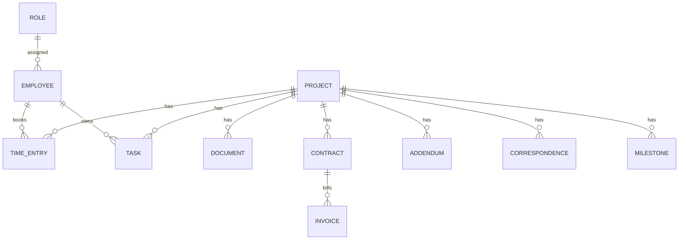

# Datenmodell

## Kernobjekte

- `Project`: Projektstamm, Auftraggeber, Leistungsbild, Phasen, Budget, Risiko, Status.
- `Employee`: Mitarbeiter, Rolle, Stundensatz, Auslastung, Rechte.
- `TimeEntry`: Zeitbuchung mit Projekt, Phase, Tätigkeit, Abrechenbarkeit.
- `Offer`: Angebot, Honorarbasis, Leistungsphasen, Nebenkosten, Nachlass.
- `Contract`: Vertrag, Version, Beauftragungsstand, Abrechnungsart.
- `Addendum`: Nachtrag, Betrag, Status, Bindefrist.
- `Invoice`: Rechnung, Leistungsstand, Zahlung, Mahnung.
- `Document`: Datei, Revision, Status, Verantwortlicher, Projektbezug.
- `Correspondence`: E-Mail, Protokoll, Aktennotiz oder Entscheidung.
- `Task`: Aufgabe mit Frist, Status, Verantwortlichem und Bereich.
- `Milestone`: Terminplan und verbindliche Fristen.
- `Role`: Berechtigungsprofil.
- `AuditLog`: protokollierte sicherheits- und abrechnungsrelevante Änderungen.

## Beziehungen

## Prinzipien

- Finanzdaten und Vertragsdaten sind versioniert.
- Dokumente werden nicht überschrieben, sondern revisioniert.
- Rollen steuern Sichtbarkeit und Aktionen getrennt.
- KI-Funktionen erhalten nur den minimal nötigen Kontext.
- Alle produktiven Änderungen an Honorar, Vertrag, Rechnung und Rechten gehören ins Audit-Log.
